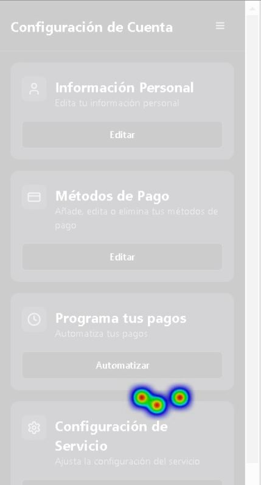
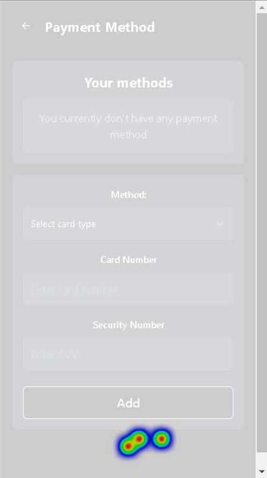
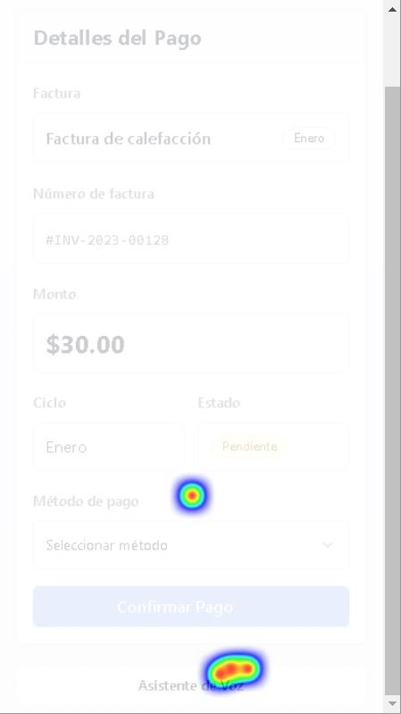
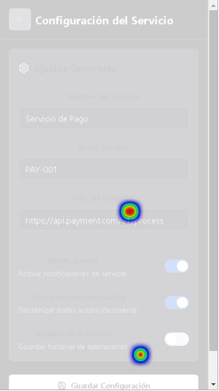
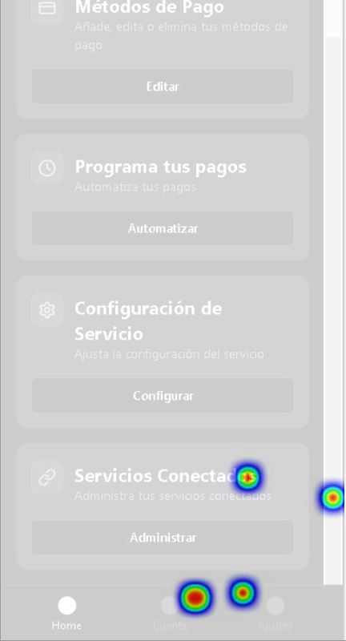

Entregable #2
Estudiantes:
    Luis Fernando Ureña Corrales - 2023064329
    Danielo Wu Zhong - 

Goal Diagram:

Estados que garantizan el éxito del sistema
    Autenticación y seguridad garantizada
    -   El usuario puede registrarse e iniciar sesión de manera segura con autenticación robusta.
    -   Sus datos personales y bancarios están protegidos y cifrados correctamente y el sistema no filtra información sensible.
    Procesamiento exitoso de pagos
    -   El usuario ejecuta un pago y este se procesa correctamente con confirmación inmediata.
    -   Integración estable con APIs bancarias sin fallos o errores en las transacciones.
    Reconocimiento preciso de comandos de voz
    -   El sistema comprende y procesa correctamente los comandos de pago hablados.
    -   El sistema de reconocimiento de comandos debe de ser redundante, por ende el porcentaje de fallos de reconocimientos debe de ser bajo.
    Manejo eficiente de errores en transacciones
    -   Si un pago falla (por saldo insuficiente, error de banco, etc.), el sistema lo notifica de inmediato (voz, pantalla y/o email).
    -   Opción de reintentar el pago o seleccionar otro método.
    Confirmación clara de cada operación
    -   El usuario recibe un resumen del pago antes de ejecutarlo y una confirmación después.
    -   Transparencia en cada transacción con historial de pagos accesible.

Se desarrollaron las siguientes pantallas en Lovable, ya que este desarrollador IA de apps soporta el desarrollo en React Native, se desarrollaron las siguientes ventanas:

 
 
 
 
 
 
 

Se desarrollo el prototipo de las ventanas en figma,este es el link para visualizarlas:
    https://www.figma.com/design/DtFZmDLd8aJHcozW3nNWGd/Payment-Assistant?node-id=0-1&t=np4Cp1nGDBbQQKHi-1

Se desarrollo un test de usabilidad con distintas tareas utilizando los prototipos pasados, se utilizo Loop11 para desarrollar el test.
    Link del Test: 
        https://www.loop11.com/ui/?l11_uid=107057
    Videos de evidencia:
        https://drive.google.com/drive/folders/1WGw0zsl1pwjCa-LWsghyva6zZm6g5N0N?usp=sharing
    Algunos heatmaps:

