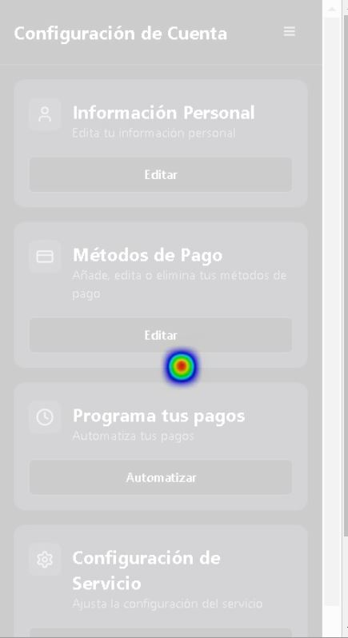

# Entregable #2

## 1. Estudiantes:
1. **Luis Fernando Ureña Corrales** - 2023064329  
2. **Danielo Wu Zhong** - 2023150448

## 2. Goal Diagram:

## 3. Estados que garantizan el éxito del sistema:

### 3.1. Autenticación y seguridad garantizada
- El usuario puede registrarse e iniciar sesión de manera segura con autenticación robusta.
- Sus datos personales y bancarios están protegidos y cifrados correctamente, evitando filtraciones de información sensible.

### 3.2. Procesamiento exitoso de pagos
- El usuario ejecuta un pago y este se procesa correctamente con confirmación inmediata.
- Integración estable con APIs bancarias sin fallos o errores en las transacciones.

### 3.3. Reconocimiento preciso de comandos de voz
- El sistema comprende y procesa correctamente los comandos de pago hablados.
- El sistema de reconocimiento de comandos debe ser redundante para minimizar los fallos de reconocimiento.

### 3.4. Manejo eficiente de errores en transacciones
- Si un pago falla (por saldo insuficiente, error de banco, etc.), el sistema lo notifica de inmediato (voz, pantalla y/o email).
- Opción de reintentar el pago o seleccionar otro método.

### 3.5. Confirmación clara de cada operación
- El usuario recibe un resumen del pago antes de ejecutarlo y una confirmación después.
- Transparencia en cada transacción con historial de pagos accesible.

## 4. Desarrollo de Pantallas según los estados de éxito
Se desarrolló pantallas esenciales en Figma, donde a la vez se hizo un prototitpo completo a partir de esas pantallas esenciales.
 🔗 [Prototipo en Figma](https://www.figma.com/design/DtFZmDLd8aJHcozW3nNWGd/Payment-Assistant?node-id=0-1&t=np4Cp1nGDBbQQKHi-1)

## 5. WireFrames en Figma
Se desarrolló el prototipo de las ventanas en **Figma**, y está disponible en el siguiente enlace:  
 🔗 [Prototipo en Figma](https://www.figma.com/design/DtFZmDLd8aJHcozW3nNWGd/Payment-Assistant?node-id=0-1&t=np4Cp1nGDBbQQKHi-1)

## 6. Desarrollo de pantallas con IA
Se desarrollaron las siguientes pantallas en **Lovable**, ya que esta herramienta soporta el desarrollo en **React Native**:

- **Pantalla Principal:**
    
    
- **Configuración de Pagos:**
    
- **Métodos de Pago:**
    
- **Información Personal:**
    
- **Configuración de Servicios:**
    
- **Lista de Servicios:**
    

## 7. Test de Usabilidad y heatmaps
### 7.1 Test de Usabilidad
Se realizó un **test de usabilidad** con distintas tareas utilizando los prototipos anteriores. Para ello, se utilizó **Loop11**.

- 🔗 **Link del Test:** [Loop11 Usability Test](https://www.loop11.com/ui/?l11_uid=107057)
- 📹 **Videos de evidencia:** [Google Drive](https://drive.google.com/drive/folders/1WGw0zsl1pwjCa-LWsghyva6zZm6g5N0N?usp=sharing)

### 7.2 Heatmaps
A continuación, se presentan algunos **heatmaps** obtenidos en el test:

- **Configuración de Cuenta**
  
- **Pago**
  
- **Métodos de Pago**
  
- **Configuración de Pagos**
  
- **Configuración de Servicios**
  
- **Servicios**
  
